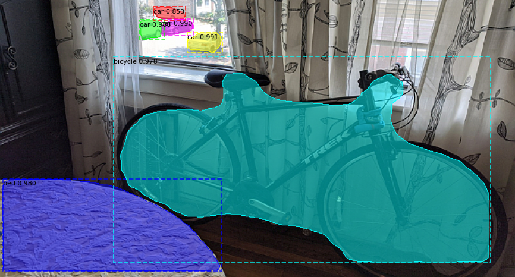
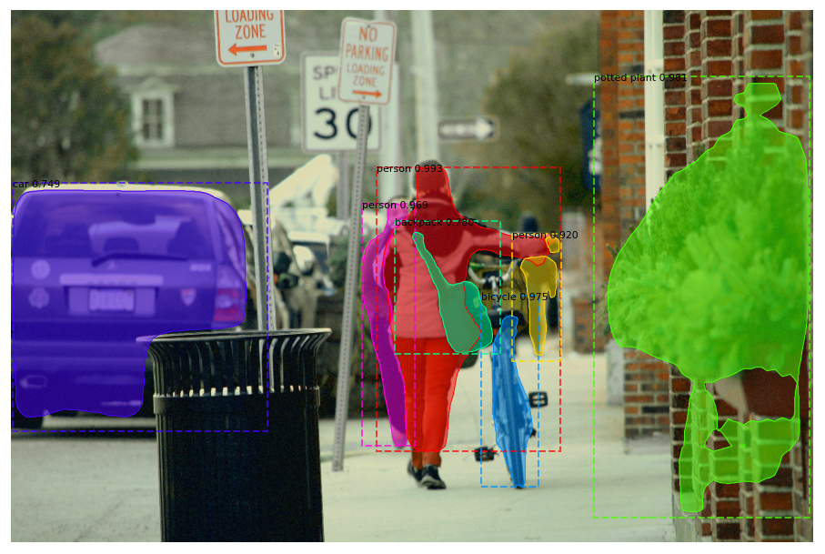

# Object Detection Transfer  Learning

 Isolated segmentation mask of bicycle in test image

## Introduction
This repository represents an exercise in image segmentation with transfer learning in Python. The project was inspired by a simple desire to perform object segmentation on a digital image. A quick search led me through a few web pages demonstrating the results of various image processing models and algorithms, until I stumbled onto an implementation of Mask R-CNN that seemed suited for a relatively quick, personal project.

## Objectives
Use a pre - trained model to performing object detection on a custom photograph.

## The Dataset
The COCO dataset is an object detection dataset with 80,000 training images in 80 classes, validated on 40,000 images.

## The Model
This particular project is run in Keras and Tensorflow, and it draws on the Mask R-CNN implementation documented in the https://github.com/matterport/Mask_RCNN repository:

@misc{matterport_maskrcnn_2017,
  title={Mask R-CNN for object detection and instance segmentation on Keras and TensorFlow},
  author={Waleed Abdulla},
  year={2017},
  publisher={Github},
  journal={GitHub repository},
  howpublished={\url{https://github.com/matterport/Mask_RCNN}},
}

## Transfer Learning
Mask R-CNN was created by Facebook AI Research (FAIR). Model architecture was built on Feature Pyramid Network (FPN) with a ResNet-101 backbone.

The model was pre - trained on the COCO dataset.

## Results

 Segmentation mask of bicycle in test image

I intentionally staged the project test photograph to include a bicycle with cars in the background and a somewhat confounding tablecloth in the foreground. The model correctly identified and labeled the bicycle (97.8% certain) as well as the cars (three at 98.8% certainty and above, and the most distant at 85.3% certainty).

As for the tablecloth: the model seems to have mistaken the ornate, textured patterning for a bed, with 98% certainty (greater confidence than it had for the bicycle).

 Segmentation results with stock image: via Unsplash

Running inference on a photograph obtained from Unsplash realized what appear to be perfect results.
