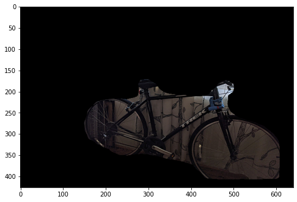

# Object Detection Transfer  Learning

Inverse mask of bicycle in test image

## Introduction

## Objectives
Implementing Mask R-CNN Image Segmentation, using pre - trained weights from the COCO algorithm; performing object detection on a custom photograph.

## The Dataset
COCO...

## The Model
Mask R-CNN architecture, from Facebook AI Research (FAIR)

## Transfer Learning
Weights pretrained on the COCO dataset, built on FPN and ResNet101 (obtainable from https://github.com/matterport/Mask_RCNN).

## Results
I intentionally staged the test photograph to include a bicycle with cars in the background and a somewhat confounding tablecloth in the foreground. The model correctly identified and labeled the bicycle (97.8% certain) as well as the cars (three at 98.8% certainty and above, and the most distant at 85.3% certainty).

As for the tablecloth: the model seems to have mistaken the ornate, textured patterning for a bed, with 98% certainty (greater confidence than it had for the bicycle).
